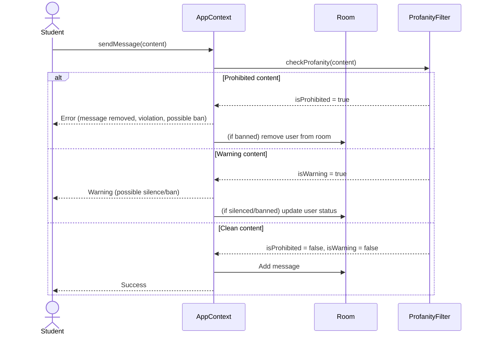
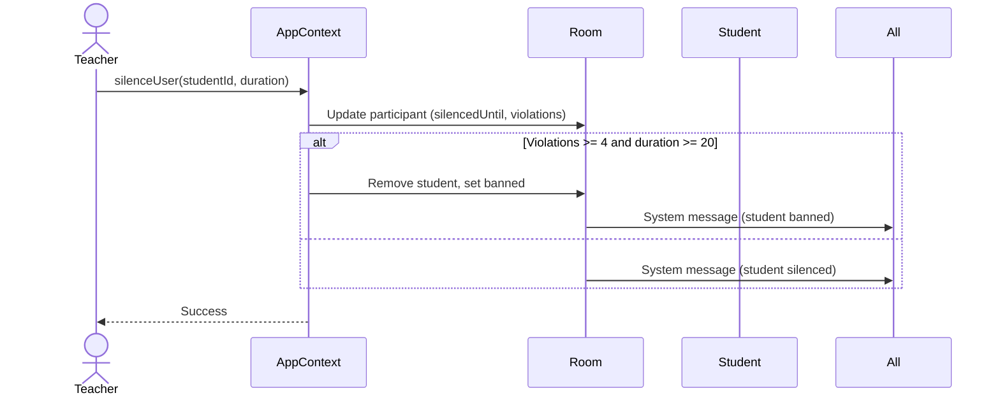
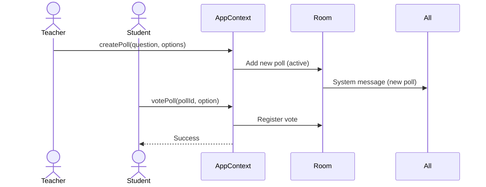
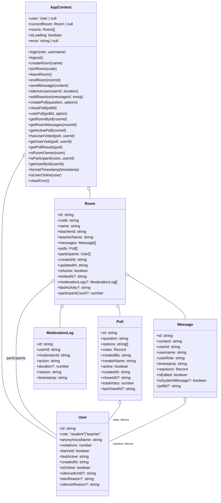

## Reviewer's Guide

This PR bootstraps the anonymous Q&A platform by adding project documentation and license, implementing core client-side logic via a React context provider (state persistence, authentication, room/chat management, messaging, moderation, polls, reactions, utilities), including unit tests for the context API, ingesting auto-generated coverage reports into the frontend, and introducing base styling and dependency locks.

#### Sequence diagram for student sending a message with moderation and profanity filter

#### Sequence diagram for teacher moderating a student (silence/ban)

#### Sequence diagram for poll creation and voting

#### Class diagram for AppContext state and actions

### File-Level Changes

| Change | Details | Files |
| ------ | ------- | ----- |
| Enrich project documentation and licensing | <ul><li>Expanded README with overview, roles, features, architecture, and future roadmap</li><li>Added LICENSE file</li></ul> | `README.md` `LICENSE` |
| Implement global app context and business logic | <ul><li>Create AppContext provider with localStorage state, auth flows, room create/join/leave</li><li>Implement messaging, moderation (silence/ban), reactions, polls, and utility hooks</li><li>Expose `useApp` hook and constants for UI constraints</li></ul> | `frontend/src/context/AppContext.jsx` |
| Add unit tests for AppContext | <ul><li>Mock `useApp` to test login/logout, room lifecycle, persistence</li><li>Verify localStorage interactions</li></ul> | `frontend/src/__tests__/context/AppContext.test.js` |
| Include code coverage reports | <ul><li>Add Istanbul‐generated HTML coverage for AppContext.jsx and App.jsx</li><li>Check coverage summaries and uncovered blocks</li></ul> | `frontend/coverage/lcov-report/src/context/AppContext.jsx.html` `frontend/coverage/lcov-report/src/App.jsx.html` |
| Introduce base styling and lock dependencies | <ul><li>Add Tailwind index.css and fadeIn keyframes</li><li>Include updated package-lock.json</li></ul> | `frontend/src/index.css` `backend/package-lock.json` |

---

